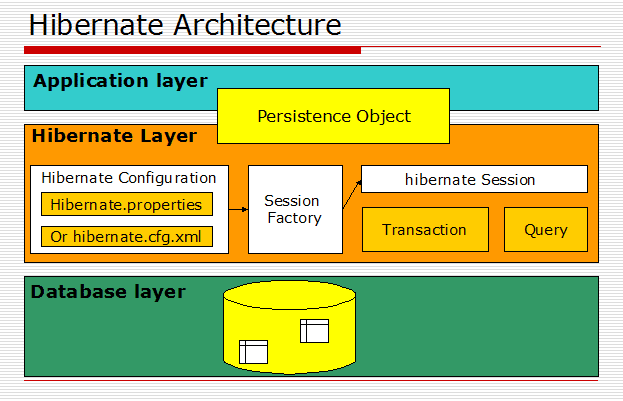

*Table of content*

1. [Giới thiệu](#overview)

2. [POJO](#pojo)

3. [Mapping dữ liệu](#mapping_data)

4. [Session](#session)

5. [Hibernate Query Language (HQL)](#hql)

-------------------------------------------

`Hibernate` là framework để lập trình viên Java có thể map các class (Pojo) với một cơ sở dữ liệu bất kì.

Trước khi `Hibernate` ra đời, lập trình viên phải thao tác với database thông qua `JDBC`. Theo thời gian `JDBC` bộc lộ nhiều điểm yếu như:

- Có nhiều code thừa mà chỉ mục đích lấy dữ liệu.
- Mất nhiều thời gian map dữ liệu vào obj Java.
- Tốn nhiều công sức khi hệ thống thay đổi (yêu cầu `JDBC` mới, code mới).
- Giao tiếp giữa các bảng thường khó, thiếu tính OOP.

Vì thế, `Hibernate` ra đời.

## Giới thiệu <a name="overview"></a>

`Hibernate` là một thư viện `ORM` (Object Relational Mapping) open source giúp map các object (Pojo) với hệ quản trị cơ sở dữ liệu quan hệ và hổ trợ các khái niệm lập trình hướng đối tượng với cơ sở dữ liệu quan hệ.

> `Hibernate` là layer trung gian giữa ứng dụng và database, ta sẽ giao tiếp với hibernate thay vì giao tiếp với database.



Để giao tiếp với `Hibernate`, ta tạo 1 `class` đại diện cho 1 `table`. Và mọi dữ liệu của `table` trong database sẽ được bind vào `class` đó bởi `Hibernate`.

## POJO - Plain Old Java Object <a name="pojo"></a>

Là `class` đại diện cho 1 `table`, nó là một `class Java thuần túy`.

1. All properties must public setter and getter methods (mọi biến đều phải có get/set)
2. All instance variables should be private (mọi biến là thuộc tính thì nên là private)

```Java
public class MyFirstPojo
{
    private String name;

    public static void main(String [] args)
    {
       for (String arg : args)
       {
          MyFirstPojo pojo = new MyFirstPojo(arg);  // Here's how you create a POJO
          System.out.println(pojo); 
       }
    }

    public MyFirstPojo(String name)
    {    
        this.name = name;
    }

    public String getName() { return this.name; } 

    public String toString() { return this.name; } 
}
```

## Mapping dữ liệu <a name="mapping_data"></a>

Khi đã có `class` đại diện cho `table`, ta định nghĩa các trường trong class đó tường ứng với column nào trong `table` bằng các `annotation` mà `Hibernate` cung cấp.

```Java
@Entity // Đánh dấu đây là một Entity, chịu sự quản lý của Hibernate
@Table(name = "USER") //Entity này đại diện cho table USER trong db
public class UserModel {
    @Id // Đánh dấu biến ở dưới là primary key của table này
    @GeneratedValue(strategy = GenerationType.IDENTITY) // Tự động tăng giá trị khi insert
    private Long id;

    @Column(name = "email", unique = true) // trường email ở dưới đại diện cho cột email trong database
    private String email; 

    @Column(name = "name")
    private String name;

    public Long getId() {
        return this.id;
    }
    public void setId(Long id) {
        this.id = id;
    }
    public String getEmail() {
        return email;
    }
    public void setEmail(String email) {
        this.email = email;
    }
    public String getName() {
        return this.name;
    }
    public void setName(String name) {
        this.name = name;
    }
}
```

Ví dụ lấy dữ liệu từ database

```Java
public List<User> findAll() {
    return session.createQuery("SELECT a FROM User a", User.class).getResultList();      
}
```

Như thế giúp tiết kiệm được rất nhiều thời gian cho việc `mapping` dữ liệu từ `database` sang `class` Java.

## Session <a name="session"></a>

> Đối tượng chính của việc truy xuất hay insert dữ liệu bằng `Hibernate` chính là `session` và được tạo ra từ `Session Factory`.

`Session Factory` là một interface giúp tạo ra `session` *kết nối* đến `database` bằng các *đọc* các cấu hình trong file `xml`, mỗi loại `database` sẽ có mỗi cấu hình khác nhau.

## Hibernate Query Language <a name="hql"></a>

[Xem thêm](https://hibernate.org/)