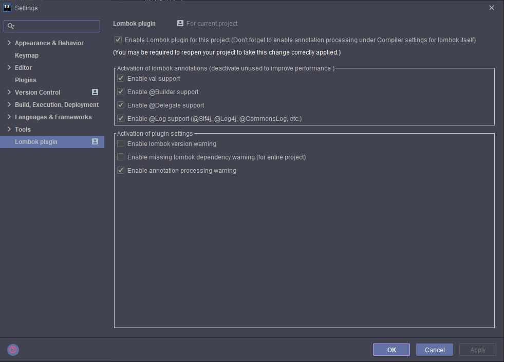
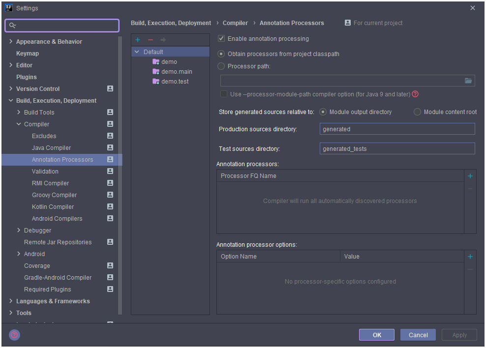

# Hướng dẫn sử dụng Lombok để code Java nhanh

## Giới thiệu

**Lombok** là một thư viện, một plugin, giúp chúng ta giảm thiểu các đoạn code thừa (boilerplate) bằng cách tự động sinh ra các hàm `Get`, `Set`, `Constructor`, v.v..

Chắc hẳn ai là `Java Developer` chinh chiến nhiều năm thì đều ngán ngẩm với việc ngồi viết những hàm `Get/Set`, Các `Constructor` có tham số lặp đi lặp lại, mặc dù các IDE đều hỗ trợ Generate tự động, tuy nhiên khi Project lớn, việc quản lý hàng chục function như vậy trông rất rối mắt và thừa thãi.

Từ đây, vị cứu tinh của chúng ta, **Lombok** ra đời
Với tiêu chí giúp developer tập trung vào tầng nghiệp vụ và logic thay vì mất thời gian làm những việc "thừa thãi". 
Không những làm cho code sáng sửa mà còn trông rất hợp lý, dễ quản lý hơn.
Sức mạnh của **Lombok** không chỉ dừng ở việc `Get/Set` mà còn nhiều khả năng tuyệt vời khác nữa.

## Cài đặt 

Cần cài `Lombok` trong project và trong IDE

1. Đưa `Lombok` vào project

> Cách tốt nhất là dùng [spring initilizr](https://start.spring.io/) để add dependency lombok vào 

2. Cài `Lombok plugin` vào IDE

Nếu không có bước này thì project sẽ bị lỗi 

Sau khi cài `Lombok`, ta cấu hình 

`Restart IDE` > `File` > `Setting` > `Other Setting` > `Lombok Plugin` > `Enable Lombok plugin` for this project > `Apply`



`File` > `Setting` > `Build`, `Execution`, `Deployment` > `Complier` > `Annotation Processors` > `Apply`



Như vậy là xong

## Sử dụng Lombok

`Lombok` dùng `annotation` để khai báo với trình biên dịch.

### Annotation @Data

Để tạo 1 đối tượng `Employee` với những hàm cơ bản thông thường ta phải viết như sau:

```java
public class Employee {
    private String name;
    private int age;

    public Employee(){}

    public void setName(String name) { this.name = name; }

    public String getName() { return name; }

    public int getAge() { return age; }

    public void setAge(int age) { this.age = age; }

    @Override
    public boolean equals(Object o) {
        if (this == o) return true;
        if (o == null || getClass() != o.getClass()) return false;
        Employee employee = (Employee) o;
        return age == employee.age &&
                Objects.equals(name, employee.name);
    }

    @Override
    public int hashCode() {
        return Objects.hash(name, age);
    }

    @Override
    public String toString() {
        return "Employee{" +
                "name='" + name + '\'' +
                ", age=" + age +
                '}';
    }
} 
```

Nhưng với `lombok` ta chỉ cần `import lombok.Data;` và viết như sau: 

```java
import lombok.Data;

@Data
public class Employee {
    private String name;
    private int age;
}
```

`@Data` sẽ có tác dụng generate ra `Construtor` theo yêu cầu, toàn bộ `Get/Set`, hàm `equals`, `hashCode`, `toString()`.

Khi đánh dấu 1 class là `@Data` thì ta có thể sử dụng các function đã generate ra mà không cần phải code thêm 1 dòng nào.

### Tự động generate constructor với `@NoArgsConstructor`, `@RequiredArgsConstructor`, `@AllArgsConstructor`

Lombok hổ trợ 3 annotation định nghĩa constructor theo ý mình:

- `@NoArgsConstructor`: Constructor rỗng.
- `@AllArgsConstructor`: Constructor chứa tất cả thuộc tính.
- `@RequiredArgsConstructor`: Constructor chỉ chứa các thuộc tính `final`

Ví dụ:

```java
@RequiredArgsConstructor
public class Employee{
    private final String id;
    private String name;
    private int age;
}
```

sẽ có Constructor

```java
public Employee(String id){
    this.id = id;
}
```

### Tự động generate các hàm Get/Set với `@Getter/@Setter`

Khi chỉ muốn generate mỗi get/set thôi và không muốn dùng `@Data` vì nó quá nhiều chức năng thì có thể sử dụng `@Getter` và `@Setter`.

```java
@Getter
@Setter
public class Employee{
    private String id;
    private String name;
}
```

Có thể chỉ xài cho 1 thuộc tính 

```java
public class Employee{
    @Getter @Setter private String id;
    @Setter(AccessLevel.PROTECTED) private String name;
}
```

### Tự động generate hàm `toString()`, `equals()` và `hashCode()` với `@ToString` và `@EqualsAndHashCode`

- `@ToString`: tạo ra hàm `toString()` từ thuộc tính class
- `@EqualsAndHashCode`: tạo ra hàm `equals()` và `hashCode()`

Nếu muốn hàm `toString()` hay `equals()` không tác động tới 1 thuộc tính nào đó thì ta dùng `Exclude`

```java
@ToString
public class Employee{
    private String id;
    @ToString.Exclude private String name;
}
```

### Tự động builder với `@Builder` 

```java
@Data
@Builder
public class Employee{
    private String id;
    private String name;
}
```

sau đó 

```java
Employee vae = Employee.builder()
                .id("001")
                .name("Dang Huu Loc")
                .build();
```