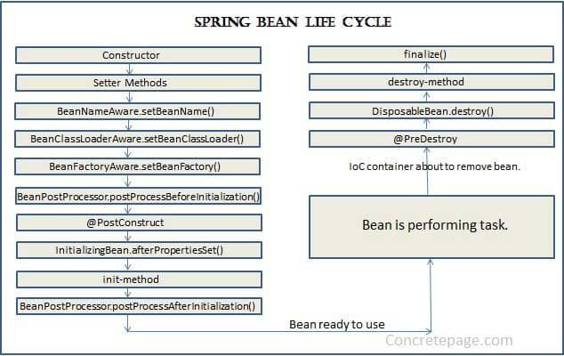
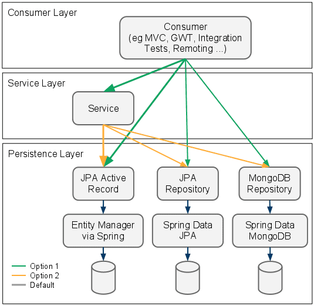
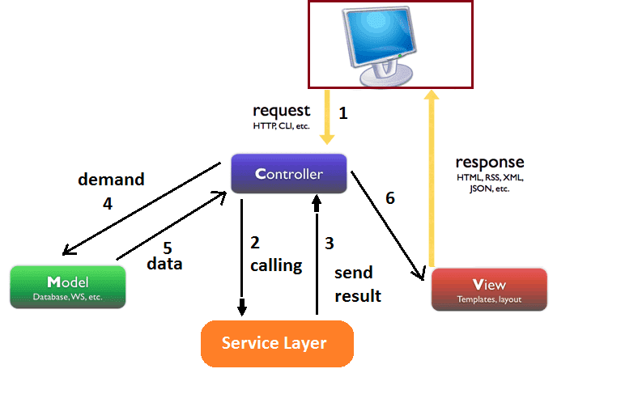
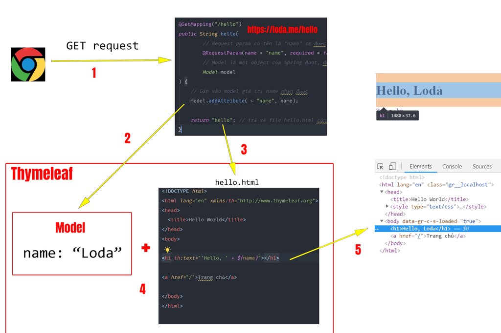
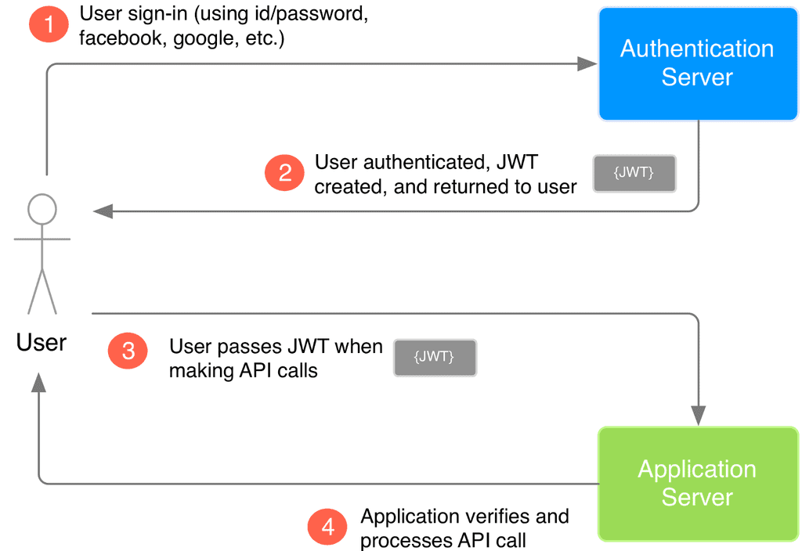

[Java cơ bản](./DOC/java-basic.md)

[Java OOP](./DOC/java-oop.md)

[Code Java nhanh sử dụng Lombok](./DOC/Lombok.md)

[Java Hibernate](./DOC/Hibernate.md)

------------------
*table of contents*

1. [Các khái niệm cần nắm](#spring_other)

2. [Cách cài đặt](#spring_install)

3. [Spring boot @Component và @Autowired](#springboot_1)

   3.1. [Annotation @Component](#spring_component)
   
   3.3.2. [Annotation @Autowired](#spring_autowired)

   3.3.3. [Annotation @Primary](#spring_primary)

4. [Spring Bean Life Cycle, @PostConstruct và @PreDestroy](#springboot_2)

   4.1. [@PostConstruct](#spring_postconstruct)

   4.2. [@PreDestroy](#spring_predestroy)

   4.3. [Bean Life Cycle](#spring_beanlifecycle)

5. [Spring boot @Component, @Service và @Repository](#springboot_3)

   5.1. [Kiến trúc trong spring boot](#springboot_architecture)

   5.2. [@Controller vs @Service vs @Repository](#springboot_csr)

6. [Component scan](#springboot_componentscan)

7. [Spring Boot @Configuration và @Bean](#springboot_conf_bean)

8. [Spring Boot Application Config và annotation @Value](#springboot_8)

9. [Spring Boot @Controller, và ví dụ tạo trang web Hello World](#springboot_9)

10. [Giải thích cách Thymeleaf vận hành + Expression + Demo Full](#springboot_10)

11. [Spring Boot @RequestMapping, @PostMapping, @ModelAttribute, @RequestParam và web to-do với Thymeleaf](#springboot_11)

12. [Spring Boot JPA, MySql, annotation @Query](#springboot_12)
   12.1. Giới thiệu
   12.2. [Cấu hình kết nối](#connection_config)
   12.3. [Query Creation](#query_creation)
   12.4. [Quy tắc đặt tên Method trong **Spring JPA**](#method_namingrules)
   12.5. [Cách sử dụng @Query](#annotation_query)
   
13. [Ví dụ Spring JPA + MySql với mô hình MVC](#springboot_13)

14. [Restful API và `@RestController`, `@PathVariable`, `@RequestBody`](#springboot_14)

    14.1. [Xây dựng Restful API cho EmployeeManager](#restful_api_employee_manager)

15. [Exception Handling @ExceptionHandler + @RestControllerAdvice/@ControllerAdvice + @ResponseStatus](#springboot_15)

16. [Spring Security](#springsecurity)
    16.1. [Cơ bản](#springsecurity_basic)
    16.2. [Spring Security và JPA Hibernate](#springsecurity_db)
    16.3. [Spring Security + JWT + Hibernate](#springsecurity_advance)

------------------


# Learn Spring Boot Framwork

## Các khái niệm cần nắm <a name="java_other"></a>

### Khái niệm tight-coupling (liên kết ràng buộc) và cách loosely coupled (liên kết lỏng lẻo)

`tight-coupling` hay "liên kết ràng buộc" là một khái niệm trong Java ám chỉ việc mối quan hệ giữa các Class quá chặt chẽ. Khi yêu cầu thay đổi logic hay một class bị lỗi sẽ dẫn tới ảnh hưởng tới toàn bộ các Class khác.

`loosely-coupled` là cách ám chỉ việc làm giảm bớt sự phụ thuộc giữa các Class với nhau.

#### Ví dụ

1. Các code level 1

```java
public class BubbleSortAlgorithm{
   public void sort(int[] array) {
      // TODO: Add your logic here
      System.out.println("Đã sắp xếp bằng thuật toán sx nổi bọt");
   }
}

public class VeryComplexService {
   private BubbleSortAlgorithm bubbleSortAlgorithm = new BubbleSortAlgorithm();

   public VeryComplexService(){
   }

   public void complexBusiness(int array[]){
      bubbleSortAlgorithm.sort(array);
      // TODO: more logic here
   }
}
```

Với cách làm ở trên, `VeryComplexService` đã hoàn thiện được nhiệm vụ, tuy nhiên, khi có yêu cầu thay đổi thuật toán sắp xếp sang QuickSort thì nghe vẻ chúng ta sẽ phải sửa lại hoàn toàn cả 2 Class trên.

Ngoài ra `BubbleSortAlgorithm` sẽ chỉ tồn tại nếu `VeryComplexService` tồn tại, vì `VeryComplexService` tạo đối tượng `BubbleSortAlgorithm` bên trong nó (hay nói cách khác là sự sống chết của `BubbleSortAlgorithm` sẽ do `VeryComplexService` quyết định), theo như cách implement này, nó là liên kết rất chặt với nhau.

2. Cách code level 2

```java
public interface SortAlgorithm {
    /**
     * Sắp xếp mảng đầu vào
     * @param array
     */
    public void sort(int array[]);
}

public class BubbleSortAlgorithm implements SortAlgorithm{

    @Override
    public void sort(int[] array) {
        // TODO: Add your logic here
        System.out.println("Đã sắp xếp bằng thuật toán sx nổi bọt");
    }
}


public class VeryComplexService {
    private SortAlgorithm sortAlgorithm;
    public VeryComplexService(){
        sortAlgorithm = new BubbleSortAlgorithm();
    }

    public void complexBusiness(int array[]){
        sortAlgorithm.sort(array);
        // TODO: more logic here
    }
}
```

Với cách làm này, `VeryComplexService` sẽ chỉ quan hệ với một interface `SortAlgorithm`. Với cách này thì mỗi quan hệ giảm bớt sự liên kết, nhưng nó không thay đổi được việc thuật toán vẫn đang là `BubbleSortAlgorithm`.

3. Cách code level 3

```java
public interface SortAlgorithm {
   /**
   * Sắp xếp mảng đầu vào
   * @param array
   */
   public void sort(int array[]);
}

public class BubbleSortAlgorithm implements SortAlgorithm{

   @Override
   public void sort(int[] array) {
      // TODO: Add your logic here
      System.out.println("Đã sắp xếp bằng thuật toán sx nổi bọt");
   }
}

public class QuicksortAlgorithm implements SortAlgorithm {
   @Override
   public void sort(int[] array) {
      // TODO: Add your logic here
      System.out.println("Đã sắp xếp bằng thuật sx nhanh");
   }
}

public class VeryComplexService {
   private SortAlgorithm sortAlgorithm;
   public VeryComplexService(SortAlgorithm sortAlgorithm){
      this.sortAlgorithm = sortAlgorithm;
   }

   public void complexBusiness(int array[]){
      sortAlgorithm.sort(array);
      // TODO: more logic here
   }
}

public static void main(String[] args) {
   SortAlgorithm bubbleSortAlgorithm = new BubbleSortAlgorithm();
   SortAlgorithm quickSortAlgorithm = new QuicksortAlgorithm();
   VeryComplexService business1 = new VeryComplexService(bubbleSortAlgorithm);
   VeryComplexService business2 = new VeryComplexService(quickSortAlgorithm);
}
```

Cách thứ ba này cũng là cách làm phổ biển nhất. Mối liên hệ giữa 2 Class đã "lỏng lẻo" hơn trước rất nhiều. `VeryComplexService` sẽ không quan tâm tới việc thuật toán sắp xép là gì nữa, mà chỉ cần tập trung vào nghiệp vụ. Còn `SortAlgorithm` sẽ được đưa vào từ bên ngoài tùy theo nhu cầu sử dụng.

### Tiêm phụ thuộc (dependency injection) và IoC (Inversion of Control) 

1. DI

> Các class không nên phụ thuộc vào các kế thừa cấp thấp mà nên phụ thuộc vào class abstraction.

`Dependency Injection` là việc các Object nên phụ thuộc vào các Abstract Class và thể hiện chi tiết của nó sẽ được Inject vào đối tượng lúc runtime.

Các cách để Inject dependency vào một đối tượng có thể kể đến như sau:

- Constructor Injection: Cái này chính là ví dụ của mình, tiêm dependency ngay vào Contructor cho tiện.

- Setter Injection: Ồ, sao không chứ 😗 chúng ta học về Setter từ những bài học vỡ lòng rồi, quá hợp lý. Xài girl.setOutfit(new Naked()) 😈

- Interface Injection: Mỗi Class muốn inject cái gì, thì phải implement một Interface có chứa một hàm inject(xx) (Gần như thay thế cho setter ý bạn). Rồi bạn muốn inject gì đó thì gọi cái hàm inject(xx) ra. Cách này hơi dài và khó cho người mới.

2. IoC

> Inversion of Control is a programming principle. flow of control within the application is not controlled by the application itself, but rather by the underlying framework.

Ta định nghĩa trước toàn bộ các `dependency` có trong Project, mô tả nó và tống nó vào 1 cái kho và giao cho một thằng tên là `framework` quản lý. Bất kỳ các `Class` nào khi khởi tạo, nó cần `dependency` gì, thì cái `framework` này sẽ tự tìm trong kho rồi `inject` vào đối tượng thay chúng ta.

## Cách cài đặt <a name="spring_install"></a>

1. Tạo một Spring boot project 

Vào https://start.spring.io/ tạo 1 project . Ở đây sử dụng `maven` và package là `com.example.blog`

Nếu trong `Java` truyền thống, khi chạy cả một project, chúng ta sẽ phải định nghĩa một hàm `main()` và để nó khởi chạy đầu tiên.

Thì **Spring Boot** cũng vậy, chúng ta sẽ phải chỉ cho **Spring Boot** biết nơi nó khởi chạy lần đầu, để nó cài đặt mọi thứ.

Cách thực hiện là thêm annotation `@SpringBootApplication` trên class chính và gọi `SpringApplication.run(BlogApplication.class, args);` để chạy project.

```java
package com.example.blog;

import org.springframework.boot.SpringApplication;
import org.springframework.boot.autoconfigure.SpringBootApplication;

@SpringBootApplication
public class BlogApplication {

	public static void main(String[] args) {
		SpringApplication.run(BlogApplication.class, args);
	}
}
```

Một trong những nhiệm vụ chính của Spring là tạo ra một cái Container chứa các Dependency cho chúng ta.

`SpringApplication.run(BlogApplication.class, args);` chính là câu lệnh *để tạo ra* **container**. Sau đó nó *tìm toàn bộ* các **dependency** trong project của bạn và đưa vào đó.

Spring đặt tên cho **container** là ***ApplicationContext***

và đặt tên cho các **dependency** là ***Bean***


## Hướng dẫn @Component và @Autowired <a name="springboot_1"></a>

`@Component` và `@Autowire` là 2 annotation (chú thích) cơ bản trong Spring boot.

### @Component là một Annotation đánh dấu trên các `class` để giúp **Spring** biết đó là một `bean`. <a name="spring_component"></a>

Ví dụ:

Ta có một interface `Keycap`

```java
public interface Keycap {
    public void insert();
}
```

implement nó là Class `Cherry`

```java
/*
 Đánh dấu class bằng @Component
 Class này sẽ được Spring Boot hiểu là một Bean (hoặc dependency)
 Và sẽ được Spring Boot quản lý
*/
@Component
public class Cherry implements Keycap {

    @Override
    public void insert() {
        System.out.println("Gắn key cap cherry profile vào keyboard");
    }
}
```

Và chạy chương trình
```java
@SpringBootApplication
public class App {
   public static void main(String[] args) {
      // ApplicationContext chính là container, chứa toàn bộ các Bean
      ApplicationContext context = SpringApplication.run(App.class, args);

      // Khi chạy xong, lúc này context sẽ chứa các Bean có đánh
      // dấu @Component.

      // Lấy Bean ra bằng cách
     	Keycap minila = context.getBean(Cherry.class);

      // In ra để xem thử nó là gì
      System.out.println("Instance: " + minila);
      // xài hàm wear()
      minila.insert();
   }
}
```

Bạn sẽ thấy `Keycap` lúc này chính là `Cherry`. Class đã được đánh dấu là `@Component`.

**Spring Boot** khi chạy sẽ dò tìm toàn bộ các *Class* cùng cấp hoặc ở trong các *package* thấp hơn so với class `BlogApplication` mà bạn cung cấp cho Spring (Chúng ta có thể cấu hình việc tìm kiếm này, sẽ đề cập sau). 
Trong quá trình dò tìm này, khi gặp một *class* được đánh dấu `@Component` thì nó sẽ tạo ra một *instance* và đưa vào `ApplicationContext` để quản lý.

### @Autowired <a name="spring_autowired"></a>

Bây giờ mình tạo ra một Class `MyKeyboard` và có một thuộc tính là `Keycap`.

Mình cũng đánh dấu `MyKeyboard` là một `@Component`. Tức **Spring Boot** cần tạo ra một *instance* của `MyKeyboard` để quản lý.

```java
@Component
public class MyKeyboard {
    @Autowired
    Keycap keycap;

    public MyKeyboard(Keycap keycap) {
        this.keycap = keycap;
    }
}
```

Tôi đánh dấu thuộc tính `Keycap` của `MyKeyboard` bởi Annotation `@Autowired`. Điều này nói với **Spring Boot** hãy tự *inject (tiêm)* một instance của `Keycap` vào thuộc tính này khi khởi tạo `MyKeyboard`.

Và chạy chương trình

```java
@SpringBootApplication
public class App {
   public static void main(String[] args) {
      // ApplicationContext chính là container, chứa toàn bộ các Bean
      ApplicationContext context = SpringApplication.run(App.class, args);

      // Khi chạy xong, lúc này context sẽ chứa các Bean có đánh
      // dấu @Component.

      // Lấy Bean ra bằng cách
      Keycap cherry = context.getBean(Cherry.class)

      // In ra để xem thử nó là gì
      System.out.println("Output Instance: " + cherry);
      // xài hàm wear()
      cherry.insert();

      MyKeyboard gk61 = context.getBean(MyKeyboard.class);

      System.out.println("Keyboard Instance: " + gk61);

      System.out.println("Keyboard Keycap: " + gk61.keycap);

      gk61.keycap.insert();
   }
}
```

**Spring Boot** đã tự tạo ra một `MyKeyboard` và trong quá trình tạo ra đó, nó truyền `Keycap` vào làm thuộc tính.

### Singleton

Điều đặc biệt là các `Bean` được quản lý bên trong `ApplicationContext` đều là ***singleton***. Bạn chắc đã để ý điều này từ các *Output* ở phía trên.

`Keycap` ở 2 đối tượng trên là một.

Tất cả những `Bean` được quản lý trong `ApplicationContext` đều chỉ được tạo ra **một lần duy nhất** và khi có `Class` yêu cầu `@Autowired` thì nó sẽ lấy đối tượng có sẵn trong `ApplicationContext` để inject vào.

Trong trường hợp bạn muốn mỗi lần sử dụng là một instance hoàn toàn mới. Thì hãy đánh dấu `@Component` đó bằng `@Scope("prototype")`

```java
@Component
@Scope("prototype")
public class Cherry implements Keycap {
   @Override
   public void wear() {
      System.out.println("Gắn key cap cherry profile vào keyboard");
   }
}
```

### Annotation Primary <a name="spring_primary"></a>

Trong ví dụ trên nếu ta có thêm nhiều class tương tự class `Cherry` (implement `Keycap`) thì chương trình sẽ báo lỗi 

```
Parameter 0 of constructor in com.example.demo.MyKeyboard required a single bean
```

Để fix chúng ta cần đặt một trong những class implement `Keycap` là `@Primary`.

## Spring Bean Life Cycle, @PostConstruct và @PreDestroy <a name="springboot_2"></a>

### @PostConstruct <a name="spring_postconstruct"></a>

`@PostConstruct` được đánh dấu trên một method duy nhất bên trong `Bean`. `IoC Container` hoặc `ApplicationContext` sẽ gọi hàm này **sau khi** một `Bean` được tạo ra và quản lý.

```java
@Component
public class Girl {

   @PostConstruct
   public void postConstruct(){
      System.out.println("\t>> Đối tượng MyKeyboard sau khi khởi tạo xong sẽ chạy hàm này");
   }
}
```

### @PreDestroy <a name="spring_predestroy"></a>

`@PreDestroy` được đánh dấu trên một method duy nhất bên trong `Bean`. `IoC Container` hoặc `ApplicationContext` sẽ gọi hàm này **trước khi** một `Bean` bị xóa hoặc không được quản lý nữa.

```java
@Component
public class Girl {

   @PreDestroy
   public void preDestroy(){
      System.out.println("\t>> Đối tượng MyKeyboard trước khi bị destroy thì chạy hàm này");
   }
}
```

### Bean Life Cycle <a name="spring_beanlifecycle"></a>

**Spring Boot** từ thời điểm chạy lần đầu tới khi *shutdown* thì các `Bean` nó quản lý sẽ có một vòng đời được biểu diễn như ảnh dưới đây:



Cần hiểu như sau:

1. Khi `IoC Container (ApplicationContext)` tìm thấy 1 `Bean` cần quản lý, nó sẽ khởi tạo bằng `constructor`

2. *Inject dependencies* vào `Bean` bằng Setter, và thực hiện các quá trình cài đặt khác vào `Bean` như `setBeanName`, `setBeanClassLoader`, v.v..

3. Gọi hàm `PostConstruct`

4. Tiền xử lý sau khi `PostConstruct` được gọi

5. `Bean` sẵn sàng để hoạt động

6. Nếu `IoC Container` không quản lý `Bean` nữa hoặc bị shutdown nó sẽ gọi hàm `@PreDestroy` trong `Bean`

7. Xóa `Bean`

### Ví dụ

Thêm `@PostConstruct` và `@PreDestroy` vào class `Girl` trong chương trước.

```java
import org.springframework.stereotype.Component;
import javax.annotation.PostConstruct;
import javax.annotation.PreDestroy;

@Component
public class MyKeyboard {

   @PostConstruct
   public void postConstruct(){
      System.out.println("\t>> Đối tượng MyKeyboard sau khi khởi tạo xong sẽ chạy hàm này");
   }

   @PreDestroy
   public void preDestroy(){
      System.out.println("\t>> Đối tượng MyKeyboard trước khi bị destroy thì chạy hàm này");
   }
}
```

và kết quả 

```
> Trước khi IoC Container được khởi tạo
> Trước khi IoC Container được khởi tạo
	>> Đối tượng MyKeyboard sau khi khởi tạo xong sẽ chạy hàm này
> Sau khi IoC Container được khởi tạo
> Trước khi IoC Container destroy MyKeyboard
	>> Đối tượng MyKeyboard trước khi bị destroy thì chạy hàm này
> Sau khi IoC Container destroy MyKeyboard
```

Bạn sẽ thấy dòng *"Trước khi IoC Container được khởi tạo"* được chạy 2 lần.

> Điều này xảy ra bởi vì hàm `App.main(args)` được chạy 2 lần!

Lần đầu là do chúng ta chạy.

Lần thứ hai là do **Spring Boot** chạy sau khi nó được gọi `SpringApplication.run(App.class, args)`. Đây là lúc mà **IoC Container** (`ApplicationContext`) được tạo ra và đi tìm `Bean`.

## @Component vs @Service vs @Repository <a name="springboot_3"></a>

### Kiến trúc trong spring boot <a name="springboot_architecture"></a>

Kiến trúc MVC trong Spring Boot được xây dựng dựa trên tư tưởng "độc lập" kết hợp với các nguyên lý thiết kế hướng đối tượng (một đại diện tiêu biểu là Dependency Inversion). 

> Độc lập ở đây ám chỉ việc các layer phục vụ các mục đích nhất định, khi muốn thực hiện một công việc ngoài phạm vi thì sẽ đưa công việc xuống các layer thấp hơn.

Kiến trúc Controller-Service - Repository chia project thành 3 lớp:



- **Consumer Layer hay Controller**: là tầng giao tiếp với bên ngoài và handler các request từ bên ngoài tới hệ thống.

- **Service Layer**: Thực hiện các nghiệp vụ và xử lý logic

- **Repository Layer**: Chịu trách nhiệm giao tiếp với các DB, thiết bị lưu trữ, xử lý query và trả về các kiểu dữ liệu mà tầng Service yêu cầu.

### @Controller vs @Service vs @Repository <a name="springboot_csr"></a>

Để phục vụ cho kiến trúc ở trên, **Spring Boot** tạo ra 3 Annotation là `@Controller`,  `@Service` và `@Repository` để chúng ta có thể đánh dấu các tầng với nhau.

- `@Service` Đánh dấu một Class là tầng `Service`, phục vụ các logic nghiệp vụ.

- `@Repository` Đánh dấu một Class Là tầng `Repository`, phục vụ truy xuất dữ liệu.

### Ví dụ

Đầu tiên ta tạo 1 class `Girl` làm `model`

```java
public class Girl {
   private String name;

   public Girl(String name) {
      this.name = name;
   }

   public String getName() {
      return name;
   }

   public void setName(String name) {
      this.name = name;
   }

   @Override
   public String toString() {
      return "Girl(" + this.name + ")";
   }
}
```

Tạo ra một interface `GirlRepository` để giao tiếp với DB.

```java
public interface GirlRepository {
   /**
   * Tìm kiếm một cô gái trong Database theo tên
   * @param name
   * @return
   */
   Girl getGirlByName(String name);
}
```

Kế thừa `GirlRepository` và đánh dấu nó là `@Repository`

```java
@Repository
public class GirlRepositoryImpl implements GirlRepository {

   @Override
   public Girl getGirlByName(String name) {
      // Ở đây tôi ví dụ là Database đã trả về
      // một cô gái với tên đúng như tham số

      // Còn thực tế phải query trong csđl nhé.
      return new Girl(name);
   }
}
```

Tạo ra một class `GỉrlService` để giải quyết các logic nghiệp vụ. Lớp `GirlService` sẽ giao tiếp với DB thông qua `GirlRepository`.

```java
import org.apache.commons.lang3.RandomStringUtils;
import org.springframework.beans.factory.annotation.Autowired;
import org.springframework.stereotype.Service;

@Service
public class GirlService {
   @Autowired
   private GirlRepository girlRepository;

   public Girl getRandomGirl(){
      // Random 1 cái tên độ dài 10
      String name = randomGirlName(10);

      // Gọi xuông tầng repository để query lấy một cô gái tên là "name" trong Database
      return girlRepository.getGirlByName(name);
   }

   public String randomGirlName(int length) {
      // Random một string có độ dài quy định
      // Sử dụng thư viện Apache Common Lang
      return RandomStringUtils.randomAlphanumeric(length).toLowerCase();
   }
}
```

và 

```java
import org.springframework.boot.SpringApplication;
import org.springframework.boot.autoconfigure.SpringBootApplication;
import org.springframework.context.ApplicationContext;

@SpringBootApplication
public class App {

   public static void main(String[] args) {
      ApplicationContext context = SpringApplication.run(App.class, args);

      // Lấy ra bean GirlService
      GirlService girlService = context.getBean(GirlService.class);
      // Lấu ra random một cô gái từ tầng service
      Girl girl = girlService.getRandomGirl();
      // In ra màn hình
      System.out.println(girl);

   }
}
```

Về bản chất `@Service` và `@Repository` cũng chính là `@Component`. Nhưng đặt tên khác nhau để giúp chúng ta phân biệt các tầng với nhau.

Trong các bài đầu tiên chúng ta đã biết `@Component` đánh dấu cho **Spring Boot** biết Class đó là `Bean`. Và hiển nhiên `@Service` và `@Repository` cũng vậy. Vì thế ở ví dụ trên chúng ta có thể lấy `GirlService` từ `ApplicationContext`.

Về bản chất thì bạn có thể sử dụng thay thế 3 Annotation `@Component`, `@Service` và `@Repository` cho nhau mà không ảnh hưởng gì tới code của bạn cả. Nó vẫn sẽ hoạt động.

Tuy nhiên từ góc độ thiết kế thì chúng ta cần *phân rõ* 3 Annotation này cho các Class đảm nhiệm đúng nhiệm vụ của nó.

- `@Service` gắn cho các Bean đảm nhiệm *xử lý logic*
- `@Repository` gắn cho các Bean đảm nhiệm *giao tiếp với DB*
- `@Component` gắn cho các Bean khác.

## Component Scan <a name="springboot_componentscan></a>

Là cách **Spring Boot** tìm kiếm `Bean` trong project.

**Spring Boot** khi chạy sẽ dò tìm toàn bộ các `Class` cùng cấp hoặc ở trong các `package` thấp hơn và tạo ra `Bean` từ các `Class` tìm thấy.

Có 2 cách để tùy chỉnh cấu hình **Spring Boot** chỉ tìm kiếm các `Bean` trong một package nhất định:

1. `@ComponentScan`.

2. Sử dụng `scanBasePackages` tromg `@SpringBootApplication`.

### Sử dụng `@ComponentScan`

```java
@ComponentScan("com.example.blog.other")
@SpringBootApplication
public class App {
   public static void main(String[] args) {
      ApplicationContext context = SpringApplication.run(App.class, args);
      try {
         Girl girl = context.getBean(Girl.class);
         System.out.println("Bean: " + girl.toString());
      } catch (Exception e) {
         System.out.println("Bean Girl không tồn tại");
      }

      try {
         OtherGirl otherGirl = context.getBean(OtherGirl.class);
         if (otherGirl != null) {
               System.out.println("Bean: " + otherGirl.toString());
         }
      } catch (Exception e) {
         System.out.println("Bean Girl không tồn tại");
      }
   }
}
```

### Sử dụng `scanBasePackages`

```java
@SpringBootApplication(scanBasePackages = "com.example.blog.other")
public class App {
   public static void main(String[] args) {
      ApplicationContext context = SpringApplication.run(App.class, args);
      try {
         Girl girl = context.getBean(Girl.class);
         System.out.println("Bean: " + girl.toString());
      } catch (Exception e) {
         System.out.println("Bean Girl không tồn tại");
      }

      try {
         OtherGirl otherGirl = context.getBean(OtherGirl.class);
         if (otherGirl != null) {
               System.out.println("Bean: " + otherGirl.toString());
         }
      } catch (Exception e) {
         System.out.println("Bean Girl không tồn tại");
      }
   }
}
```

Theo như 2 ví dụ này, ta chỉ tìm các `Bean` trong `com.example.blog.other` nên kết quả sẽ như thế này:

```
Bean Girl không tồn tại
Bean: OtherGirl.java
```

> Có thể cấu hình để tìm `Bean` ở nhiều package khác nhau 

```java
@ComponentScan({"com.example.blog","com.example.blog.other"})
// hoặc
@SpringBootApplication(scanBasePackages = {"com.example.blog", "com.example.blog.other"})
```

## Spring Boot @Configuration và @Bean <a name="springboot_conf_bean"></a>

`@Configuration` là một Annotation đánh dấu trên một `Class` cho phép **Spring Boot** biết được *đây là nơi định nghĩa ra các `Bean`*.

`@Bean` là một Annotation được đánh dấu trên các method cho phép **Spring Boot** biết được *đây là `Bean`* và sẽ *thực hiện đưa `Bean` này vào `Context`*.

`@Bean` sẽ nằm trong các class có đánh dấu `@Configuration`.

### Ví dụ

viết 1 class `SimpleBean`

```java
public class SimpleBean {
   private String username;

   public SimpleBean(String username) {
      setUsername(username);
   }

   @Override
   public String toString() {
      return "This is a simple bean, name: " + username;
   }

   public String getUsername() {
      return username;
   }

   public void setUsername(String username) {
      this.username = username;
   }
}
```

class `AppConfig`

```java
import org.springframework.context.annotation.Bean;
import org.springframework.context.annotation.Configuration;

@Configuration
public class AppConfig {

   @Bean
   SimpleBean simpleBeanConfigure(){
      // Khởi tạo một instance của SimpleBean và trả ra ngoài
      return new SimpleBean("loda");
   }
}
```

và xử lý trong `BlogAppication`

```java
import org.springframework.boot.SpringApplication;
import org.springframework.boot.autoconfigure.SpringBootApplication;
import org.springframework.context.ApplicationContext;

@SpringBootApplication
public class BlogApplication {
   public static void main(String[] args) {

      ApplicationContext context = SpringApplication.run(BlogApplication.class, args);
      // Lấy ra bean SimpleBean trong Context
      SimpleBean simpleBean = context.getBean(SimpleBean.class);
      // In ra màn hình
      System.out.println("Simple Bean Example: " + simpleBean.toString());
   }
}
```

`SimpleBean` là một object được quản lý trong `Context` của **Spring Boot**, mặc dù trong bài này, chúng ta không hề sử dụng tới các khái niệm `@Component`.

Đằng sau chương trình, **Spring Boot** lần đầu khởi chạy, ngoài việc đi tìm các `@Component` thì nó còn làm một nhiệm vụ nữa là tìm các class `@Configuration`.

1. Đi tìm class có đánh dấu `@Configuration`
2. Tạo ra đối tượng từ class có đánh dấu `@Configuration`
3. Tìm các method có đánh dấu `@Bean` trong đối tượng vừa tạo
4. Thực hiện gọi các method có đánh dấu `@Bean` để lấy ra các `Bean` và đưa vào `Context`.

Ngoài ra, về bản chất, `@Configuration` cũng là `@Component`. Nó chỉ khác ở ý nghĩa sử dụng. (Giống với việc class được đánh dấu `@Service` chỉ nên phục vụ logic vậy).

> nếu một `Bean` có quá nhiều logic để khởi tạo và cấu hình, thì chúng ta sẽ sử dụng `@Configuration` và `@Bean` để tự tay tạo ra Bean. 

### Ví dụ cấu hình kết nối Database sử dụng `@Configuration` và `@Bean`

Đầu tiên, ta tạo 1 abstract class là `DatabaseConnector` để có thể phục vụ cho nhiều ngữ cảnh

```java
public abstract class DatabaseConnector {
   private String url;

   public abstract void connect();

   public String getUrl() {
      return url;
   }

   public void setUrl(String url) {
      this.url = url;
   }
}
```

Kế thừa class này có 2 class: MySqlConnector, MongoDBConnector.

```java
public class MySqlConnector extends DatabaseConnector{
   @Override
   public void connect(){
      System.out.println("Đã kết nối tới Mysql: " + getUrl());
   }
}
```

và

```java
public class MongoDB extends DatabaseConnector{
    @Override
    public void connect(){
        System.out.println("Đã kết nối tới MongoDB: " + getUrl());
    }
}
```

Sao đó, ta tạo `Bean` trong `AppConf`

```java
@Configuration
public class AppConf {
    @Bean("mysqlConnector")
    DatabaseConnector mysqlConfigure(){
        DatabaseConnector mysqlConnector = new MySqlConnector();
        mysqlConnector.setUrl("jdbc:mysql://host1:33060/blog");
        return mysqlConnector;
    }

    @Bean("mongodbConnector")
    DatabaseConnector mongodbConfigure(){
        DatabaseConnector mongodbConnector = new MongoDB();
        mongodbConnector.setUrl("mongodb://mongodb0.example.com:27017/blog");
        return mongodbConnector;
    }
}
```

Và chạy thử,

```java
@SpringBootApplication
public class BlogApplication {

	public static void main(String[] args) {

		ApplicationContext context = SpringApplication.run(BlogApplication.class, args);

		DatabaseConnector mysql = context.getBean(MySqlConnector.class);
		mysql.connect();

		DatabaseConnector mongodb = context.getBean(MongoDB.class);
		mongodb.connect();
	}
}
```

> Thực tế, việc sử dụng `@Configuration` là hết sức cần thiết, và nó đóng vai trò là **nơi cấu hình** cho toàn bộ ứng dụng. 

Một Ứng dụng sẽ có nhiều class chứa `@Configuration` và mỗi class sẽ đảm nhận cấu hình một bộ phận gì đó trong ứng dụng.

### Ví dụ 1 đoạn code cấu hình **Spring Security**

```java
@Configuration
@EnableWebSecurity
public class WebSecurityConfig extends WebSecurityConfigurerAdapter {
    @Override
    protected void configure(HttpSecurity http) throws Exception {
        http
            .authorizeRequests()
                .antMatchers("/", "/home").permitAll()
                .anyRequest().authenticated()
                .and()
            .formLogin()
                .loginPage("/login")
                .permitAll()
                .and()
            .logout()
                .permitAll();
    }

    @Bean
    @Override
    public UserDetailsService userDetailsService() {
        UserDetails user =
             User.withDefaultPasswordEncoder()
                .username("user")
                .password("password")
                .roles("USER")
                .build();

        return new InMemoryUserDetailsManager(user);
    }
}
```

## Spring Boot Application Config và annotation @Value <a name="springboot_8"></a>

Trong thực tế không phải lúc nào chúng ta cũng nên để mọi thứ trong code của mình. Có những thông số tốt hơn hết nên được truyền từ bên ngoài vào ứng dụng, để giúp ứng dụng của bạn dễ dàng thay đổi giữa các môi trường khác nhau.

Để phục vụ điều này, chúng ta sẽ tìm hiểu về khái niệm config ứng dụng **Spring Boot** với `application.properties`

### application.properties

Trong Spring Boot, các thông tin cấu hình mặc định được lấy từ file resources/applications.properties.

Ví dụ, bạn muốn Spring Boot chạy trên port 8081 thay vì 8080:

```
server.port = 8081
```

Hoặc bạn muốn log của chương trình chi tiết hơn. Hãy chuyển nó sang Debug bằng cách config như sau:

```
logging.level.root=DEBUG
```

Đây là cách chúng ta có thể can thiệp vào các cấu hình của ứng dụng từ bên ngoài. Cho phép thay đổi linh hoạt tùy môi trường.

### Annotation @Value

Trong trường hợp, bạn muốn tự config những giá trị của riêng mình, thì Spring Boot hỗ trợ bạn với annotation `@Value`

Ví dụ, tôi muốn cấu hình cho thông tin Database của tôi từ bên ngoài ứng dụng

```
loda.mysql.url=jdbc:mysql://host1:33060/loda
```

> `@Value` được sử dụng trên thuộc tính của class, Có nhiệm vụ lấy thông tin từ file properties và gán vào biến.

```java
public class AppConfig {
    // Lấy giá trị config từ file application.properties
    @Value("${loda.mysql.url}")
    String mysqlUrl;
}
```

Thông tin truyền vào annottaion `@Value` chính là tên của cấu hình đặt trong dấu `${name}`

## Spring Boot Controller và ví dụ Hello World <a name="springboot_9"></a>

### Controller 

Để xây dựng một trang web với `Spring Boot` cần tuân thủ quy trình sau:



`@Controller` là nơi tiếp nhận các thông tin request từ phía người dùng. Nó có nhiệm vụ đón nhận các yêu cầu và chuyển các yêu cầu này xuống cho tầng `@Service` xử lý logic.

### Ví dụ tạo trang web Hello World

> Ví dụ nảy có sử dụng Thymeleaf: Đây là một Template Engine hỗ trợ chúng ta tạo ra các file html để trả về thông tin cho người dùng.

Mặc định trong **Spring Boot** các file html sẽ được lưu trữ trong thư mục `resources/templates`

Đầu tiên, ta tạo một `@Controller`

```java
@Controller
public class WebController {
    // Đón nhận request GET
    @GetMapping("/") // Nếu người dùng request tới địa chỉ "/"
    public String index() {
        return "index"; // Trả về file index.html
    }
}
```

và một file html đơn giản 

```html
<h1>Hello, World</h1>
```

> Đừng quên thêm thymeleaf vào file `build.gradle`

Bản thân `@Controller` cũng là một Component nên nó sẽ được **Spring Boot** quản lý. 

**Spring Boot** sẽ lắng nghe các request từ phía người dùng và tùy theo `path` là gì, nó sẽ mapping tới vị trí hàm xử lý tương ứng trong `@Controller`.

Như ví dụ trên, tôi sử dụng `GET` vào địa chỉ `localhost:8080/` ( đường dẫn là /). **Spring Boot** sẽ gọi tới hàm có gắn `@GetMapping("/")` và yêu cầu hàm này xử lý `request` này.

### Ví dụ mở rộng

Ví dụ nhập tên vào và xuất ra Hello, tên.

Đầu tiên, tạo các file html làm giao diện cho web

*index.html*

```HTML
<head>
    <title>Hello World</title>
</head>
<body>

<h1>Demo website Spring Boot</h1>

<a href="/about">About</a>

<form method="get" action="/hello">
    <input type="input" name="name">
    <button type="submit">Submit</button>
</form>
</body>
```

*about.html*

```HTML
<head>
    <meta charset="UTF-8">
    <title>About</title>
</head>
<body>
    <h1>Tôi là tôi</h1>
</body>
```

*hello.html*

```html
<head>
    <title>Hello World</title>
</head>
<body>
    <h1 th:text="'Hello, ' + ${name}"></h1>
    <a href="/">Trang chủ</a>
</body>
```

Sau đó, mapping các `path` với các hàm xử lý trong `WebController`

```java
@Controller
public class WebController {

    @GetMapping("/")
    public String index(){
        return "index";
    }

    @GetMapping("/about")
    public String about(){
        return "about";
    }

    @GetMapping("/hello")
    // Model là một object của Spring Boot, được gắn vào trong mọi request.
    public String hello(@RequestParam(name = "name", required = false, defaultValue = "World") String name, Model model){
        // Gắn vào model giá trị name nhận được
        model.addAttribute("name", name);
        return "hello";
        // trả về file hello.html cùng với thông tin trong object Model
    }
}
```

Khi nhập tên vào form và bấm submit thì đường dẫn sẽ thành: http://localhost:8080/hello?name=vae

Ta sẽ nhận được giá trị của `name` và gán nó vào `Model`.



`Model` ở đây là một object được **Spring Boot** đính kèm trong mỗi response.

`Model` chứa các thông tin mà bạn muốn trả về và **Template Engine** sẽ trích xuất thông tin này ra thành html và đưa cho người dùng.

Trong file `hello.html` tôi lấy giá trị của `name` trong `Model` ra bằng cách sử dụng cú pháp của `Thymeleaf`

```java
<h1 th:text="'Hello, ' + ${name}"></h1>
```

## Giải thích cách Thymeleaf vận hành, Expression và ví dụ minh họa <a name="springboot_10"></a>

### Giới thiệu cơ bản về Thymeleaf 

**Thymeleaf** là một `Java Template Engine`. Có nhiệm vụ *xử lý và generate* ra các file HTML, XML, v.v..

Các file HTML do **Thymeleaf** tạo ra là nhờ kết hợp dữ liệu và template + quy tắc để sinh ra một file HTML chứa đầy đủ thông tin.

Việc của bạn là cung cấp dữ liệu và quy định template như nào, còn việc dùng các thông tin đó để render ra HTML sẽ do **Thymeleaf** giải quyết.

### Cú pháp của Thymeleaf 

Cú pháp của **Thymeleaf** sẽ là một `attributes` (Thuộc tính) của thẻ HTML và bắt đầu bằng chữ `th:`.

Với cách tiếp cận này, bạn sẽ chỉ cần sử dụng các thẻ HTML cơ bản đã biết mà không cần bổ sung thêm syntax hay thẻ mới như JSP truyền thống.

Ví dụ: Để truyền dữ liệu từ biến `name` trong Java vào một thẻ `H1` của HTML.

```html
<h1 th:text="${name}"></h1>
```

Chúng ta viết thẻ `H1` như bình thường, nhưng không chứa bất cứ text nào trong thẻ. Mà sử dụng cú pháp `th:text="${name}"` để **Thymeleaf** lấy thông tin từ biến `name` và đưa vào thẻ `H1`.

Kết quả khi render ra:
Giả sử String name = "Vae"

```html
<h1>vae</h1>
```

thuộc tính `th:text` biến mất và giá trị biến `name` được đưa vào trong thẻ `H1`.

Đó là cách **Thymeleaf** hoạt động.

### Model & View trong Spring Boot

`Model` là đối tượng lưu giữ thông tin và được sử dụng bởi `Template Engine` để generate ra webpage. Có thể hiểu nó là `context` của **Thymeleaf**.

`Model` lưu giữ thông tin dưới dạng key-value

Trong template **thymeleaf**, để lấy các thông tin trong `Model`. bạn sẽ sử dụng `Thymeleaf Standard Expression`.

- `${...}`: giá trị của 1 biến (variable expression)
- `*{...}`: giá trị của 1 biến được chỉ định (variable expression on selection)
- `#{...}`: lấy message (message expression)
- `@{...}`: Lấy đường dẫn URL dựa theo context của server (URL expression)

#### Ví dụ minh họa cho từng expression

1. ***${...} - variable expression***

Đưa vào model một giá trị

```java
model.addAttribute("today", "Monday");
```

Để lấy giá trị của biến today, ta sử dụng `${...}`

```html
<p>Today: <span th:text="${today}"></span><p>
```
Đoạn expression trên tương ứng với:

```java
ctx.getVariable("today");
```

2. ***{...} - variable expression on selections**

Dấu `*` còn được gọi là asterisk syntax. Chức năng của nó giống với variable expression.

Điểm khác biệt là nó sẽ lấy giá trị của 1 biến được cho trước bởi `th:object`.

```html
<div th:object="${session.user}">
<!-- th:object tồn tại trong phạm vi của thẻ div này -->
    <p>Name: <span th:text="*{firstName}"></span></p>

    <p>Age: <span th:text="*{age}"></span></p>
</div>
```

Còn variable expression sẽ lấy giá trị trong `Model` hay `Context`

Vậy đoạn code trên tương đương với các sử dụng variable expression

```html
<div>
    <p>Name: <span th:text="${session.user.firstName}"></span></p>

    <p>Age: <span th:text="${session.user.age}"></span></p>
</div>
```

3. ***#{...} - message expression***

Ví dụ trong file config `.properties` có một messenger chào người dùng.

```
home.welcome = Hello bà con
```

thì cách lấy nó ra nhanh nhất là:

```html
<p th:utext="#{home.welcome}">xin chào các bạn</p>
```

Đoạn text "xin chào các bạn" sẽ bị thay thế bới thymeleaf khi render `#{home.welcome}`

4. ***@{...} - URL expression***

`@{...}` xử lý và trả ra giá trị URL theo context của máy chủ cho chúng ta.

Nếu bắt dầu bằng dấu / thì nó sẽ là Relative URL và sẽ tương ứng theo context của máy chủ của bạn.

### Demo minh họa

Tạo cấu trúc thư mục

```
src
|-  main
       |- java
          |- com.example.demo
             DemoApplication.java
             Info.java
             WebController.java
       |- resources 
          |- i18n
             |- messages.properties
             |- messages_vi.properties
             |- messages_en.properties
          |- static
             |- css
             |- js
          |- templates
          application.properties
```


nội dung file `application.properties` để cấu hình ứng dụng

```
#Chạy ứng dụng trên port 8085
server.port=8085

# Bỏ tính năng cache của thymeleaf để lập trình cho nhanh
spring.thymeleaf.cache=false

# Các message tĩnh sẽ được lưu tại thư mục i18n
spring.messages.basename=i18n/messages


# Bỏ properties này đi khi deploy
# Nó có tác dụng cố định ngôn ngữ hiện tại chỉ là Tiếng Việt
spring.mvc.locale-resolver=fixed

# Mặc định ngôn ngữ là tiếng việt
spring.mvc.locale=vi_VN
# Đổi thành tiếng anh bằng cách bỏ comment ở dứoi
# spring.mvc.locale=en_US
```

Tôi làm 1 câu chào đơn giản cho 2 vùng US và VN

*i18n/messages_vi.properties*

```
demo.hello = Chào bà con 
```

*i18n/messages_en.properties*

```
demo.hello = Hello everybody
```

Làm web thì không thể thiếu `css` và `javascript`. Các file này sẽ được lưu trử tại thư mục `resources/static`.

File `.html` là dạng template sử dụng để render ra webpage và trả về cho người dùng. Nó sẽ được lưu tại thư mục `resources/templates`

**Thymleaf** sẽ tự biết tìm đường tới những tài nguyên này.

`index.html` sẽ là file mặc định mà **Thymeleaf** tìm đầu tiên và trả về mỗi khi người dùng vào địa chỉ `/` hay `https://localhost:8085/` mà chúng ta không cần `config` gì cả.

Trong `index.html` tôi sẽ:

1. Gọi ra `bootstrap.css` và `bootstrap.js` trong thư mục `resource/static` bằng expression `@{...}`

2. Hiển thị dòng chữ chào `demo.hello` trong thư mục `resource/i18n` bằng expression `#{...}`

Tẹo template `index.html`

```html
<!DOCTYPE html>
<html xmlns:th="http://www.thymeleaf.org">
<head>
    <meta charset="UTF-8"/>
    <title>Hello World</title>
    <meta http-equiv="content-type" content="text/html; charset=UTF-8"/>

    <!-- css -->
    <link th:href="@{/css/bootstrap.css}" rel="stylesheet">

    <!-- js -->
    <script th:src="@{/js/bootstrap.js}"></script>
</head>
    <body>
        <h1 th:utext="#{demo.hello}"></h1>

        <a th:href="@{/profile}" class="btn btn-primary">click me</a>
    </body>
</html>
```

Tiếp theo, ta tạo một class `Info` để lưu giữ thông tin (có sử dụng [Lombok](./DOC/Lombok.md) để viết cho nhanh)

```java
import lombok.Data;
import lombok.AllArgsConstructor;

@Data
@AllArgsConstructor
public class Info {
    String key;
    String value;
}
```

Sau đó, tạo 1 `Constroller` để xử lý request tới `profile` 

```java
@GetMapping("/profile")
    public String profile(Model model){
        //Lưu thông tin vào list
        List<Info> profile = new ArrayList<>();
        profile.add(new Info("name", "Đặng Hữu Lộc"));
        profile.add(new Info("age", "20"));
        profile.add(new Info("Lover", "Yến nùn"));
        
        //lưu profile vào model
        model.addAttribute(profile);
        
        //trả về template profile.html
        return "profile";
    }
```

Và tạo `template` để hiện thị các phần tử `profile`

```html
<!DOCTYPE html>
<html lang="en" xmlns:th="http://www.thymeleaf.org">
<head>
    <meta charset="UTF-8">
    <title>Demo</title>
</head>
<body>
    <h1>Welcome to my website</h1>
    <p>Thông tin cá nhân</p>
    <br>
    <ul>
         <!-- Duyệt qua toàn bộ phần tử trong biến vaeProfile và gọi nó là info -->
        <li th:each="info: ${vaeProfile}">
            <!-- Với mọi phần tử lấy ra key, value-->
            <span th:text="*{info.key}"></span>: <span th:text="*{info.value}"></span>
        </li>
    </ul>
</body>
</html>
```

Ở đây, ta đã sử dụng 2 expression là 

- Variable expression (`${...}`): để lấy giá trị của biến `vaeProfile` trong `Model`
- Variable expression on selection (`*{...}`): để lấy giá trị của biến `info`

## Spring Boot @RequestMapping, @PostMapping, @ModelAttribute, @RequestParam và web to-do với Thymeleaf <a name="springboot_11"></a>

### Kiến thức căn bản

`@PostMapping` có nhiệm vụ đánh dấu hàm xử lý `POST` request trong Constroller. Cách sử dụng tương tự như `@GetMapping`.

Trong trường hợp muốn tất cả các method dùng chung một cách xử lý thì có thể dùng `@RequestMapping`.

`@RequestMapping` là một annotation có ý nghĩa và mục đích sử dụng rộng hơn các loại annotation như `@GetMapping`, `@PostMapping`,...

`@RequestParam` dùng để đánh dấu 1 biến là request param trong request gửi lên server. Nó gán dữ liệu của param-name tương ứng vào biến.

`@ModelAttribute` là một chú thích liên kết với một số phương pháp hay phương pháp giá trị trả về một thuộc tính mô hình tên và sau đó hiển thị nó cho một trang web xem.
Cách hoạt động tương tự như `@RequestParameter` khi chúng ta chỉ nhận được một tham số và gán giá trị cho một số trường. Chỉ khác là `@ModelAttribution` chứa tất cả dữ liệu biểu mẫu thay vì một tham số duy nhất. Nó tạo ra một `bean` cho bạn chứa dữ liệu được gửi bởi nhà phát triển sau này.


Ví dụ: cách sử dụng của `@RequestMapping`

```java
@Constroller
@RequestMapping("api/v1")
public class WebConstroller{

   // path lúc này là /api/v1/addTodo và method GET
   @RequestMapping(value="/addTodo", method=RequestMethod.GET)
   public String addTodo(Model model){
      return "addTodo";
   }

   // path lúc này là /api/v1/addTodo và method POST
   @RequestMapping(value="/addTodo", method=RequestMethod.POST)
   public String addTodo(@ModelAttribute Todo todo){
      return "success";
   }
}
```

nếu không chỉ định method cho `@RequestMapping` nó sẽ tự động nhận tất cả các method.

### Ví dụ minh họa Web ToDo

Trong ví dụ này ta sử dụng 3 class Java: `App`, `Todo`, `WebConstroller` và 4 template HTML: `index`, `addTodo`, `listTodo`, `success`.

Tạo template `index`

```HTML

```

Ta sẽ tạo một `Model` là `Todo` để thể hiện thông tin.

```java
import lombok.Data;

@Data
public class Todo {
    public String title;
    public String detail;
}
```

Tiếp theo, ta sẽ sử dụng đường dẫn `/listTodo` và method `GET` để lấy ra danh sách những việc cần làm.

```java
@Controller
public class WebController {
    // Tạm sử dụng List vì chưa có Database
    List<Todo> todoList = new CopyOnWriteArrayList<>();

    @GetMapping("/listTodo")
    public String index(
        @RequestParam(value = "limit", required = false) Integer limit, 
       Model model){
           //Nếu gửi dùng gửi lên tham số limit thì thêm subList của todoList vào Model
           model.addAttribute("todoList", limit != null ? todoList.subList(0,limit) : todoList);

           return "listTodo";
    }
}
```

Tiếp theo, ta sẽ làm template `listTodo`

```HTML
<!DOCTYPE html>
<html lang="en" xmlns:th="http://www.thymeleaf.org">
<head>
    <meta charset="UTF-8">
    <title>To do</title>
</head>
<body>
<h1 style="text-align: center">Danh sách công việc</h1>

    <div class="container px-5">
        <ul>
           <li th:each="todo: ${todoList}">
               <span th:text="*{todo.getTitle()}"></span>: <span th:text="*{todo.getDetail()}"></span>
           </li>
        </ul>

        <a th:href="@{/addTodo}" class="btn btn-primary">+ Thêm công việc</a>
    </div>
</body>
</html>
```

`GET/addTodo` để trả về webpage cho người dùng nhập thông tin công việc và thêm vào danh sách việc cần làm. 

```Java
@GetMapping("/addTodo")
    public String addTodo(Model model){
        model.addAttribute("todo", new Todo());
        return "addTodo";
    }
```

Và làm 1 template để user nhập công việc vào

```HTML
<h1 style="text-align: center">Thêm công việc</h1>

<div class="container px-5">
    <form th:action="@{/addTodo}" th:object="${todo}" method="post">
        <div class="form-group">
            <label for="title">Title</label>
            <input type="text" class="form-control" id="title" th:field="*{title}">
        </div>
        <div class="form-group">
            <label for="detail">Detail</label>
            <input type="text" class="form-control" id="detail" th:field="*{detail}">
        </div>
        <button type="submit" class="btn btn-success">Thêm</button>
    </form>
</div>
```

Ở đây, tôi gắn vào 1 `Model` đối tượng `Todo`.

Trong form, chúng ta lấy ra đối tượng Todo chỉ định bởi `th:object="${todo}"` và gán thông tin người dùng vào `Todo` bằng cú pháp `th:field="*{tên_thuộc_tính}"`. 

Bấm `button` thì `Form` gửi request `POST` có chứa `Todo` lên path `/addTodo`

Tiếp theo, ta viết `Constroller` xử lý `POST/addTodo` thêm công việc vào List.

```Java
// @ModelAttribute đánh dấu đối tượng Todo được gửi lên bởi Form Request đã được chỉ định bởi /// th:object="${todo}"

@PostMapping("/addTodo")
    public String addTodo(@ModelAttribute Todo todo){
        todoList.add(todo);

        return "success";
    }
```

Tạo 1 template `success` để cho biết là đã tạo Todo thành công.

## Spring Boot JPA, MySql, annotation @Query <a name="springboot_12"></a>

### Giới thiệu

`Spring Boot JPA` là một phần trong hệ sinh thái Spring Data, nó tạo ra 1 layer giữa tầng `service` và `Database`, giúp chúng ta thao tác với Database một cách dễ dàng hơn, tự động config giảm thiểu code thừa.

`Spring Boot JPA` đã wrapper Hibernate và tạo ra 1 Interface mạnh mẻ. Giúp giải quyết vần đề khi gặp khó khăn với Hibernate.

Cài đặt dependency `Spring Boot JPA` vào project. [Xem thêm](https://spring.io/guides/gs/accessing-data-mysql/)

### Tạo Table, thêm user cho Table và viết thủ tục thêm dữ liệu vào table

Vào `phpmmyadmin` tạo một Database là `employee_manager` và 1 bảng `employee` như sau

```SQL
CREATE Database employee_manager;
use employee_manager;
CREATE TABLE `employee`
(
  `id`         bigint(20) NOT NULL      AUTO_INCREMENT,
  `name`   		text  NULL          DEFAULT NULL,
  `age`    int                  DEFAULT NULL,
  `email`      text                    DEFAULT NULL,
  PRIMARY KEY (`id`)
);
```

Tạo 1 `user` là `springuser` với `password` là `ThePassword` để quản lý csdl này. Sau đó, cung cấp tất cả các đặc quyền cho `springuser` trên Database `employee_manager`. 

```MySql
create user 'springuser'@'%' identified by 'ThePassword'; -- Creates the user
grant all on employee_manager.* to 'springuser'@'%'; -- Gives all privileges to the new user on the newly created Database
```

### Cấu hình kết nối MySql với Project <a name="connection_config"></a>

Thêm `runtimeOnly 'mysql:mysql-connector-java'` vào dependencies trong `build.gradle`.

Cấu hình trong file `application.properties`

```properties
spring.jpa.hibernate.ddl-auto=update
spring.datasource.url=jdbc:mysql://${Witcher-Creator:localhost}:3308/employee_manager
spring.datasource.username=springuser
spring.datasource.password=
```

Ở đây, `spring.jpa.hibernate.ddl-auto` có thể là `none`, `update`, `create` hoặc `create-drop`. Xem thêm chi tiết tại [Hibernate document](https://docs.jboss.org/hibernate/orm/5.4/userguide/html_single/Hibernate_User_Guide.html#configurations-hbmddl).

- `none`: mặc định cho `MySql`, không có thay đổi nào được thực hiện với cấu trúc Database.
- `update`: `Hibernate` thay đổi Database theo cấu trúc thực thể đã cho.
- `create`: tạo Database mọi lúc nhưng không drop khi đóng.
- `create-drop`: tạo Database và xóa nó khi `SessionFactory` đóng.

Khi chạy chương trình lần đầu tiên phải dùng `create` hoặc `update` bởi vì lúc này chưa có cấu trúc của Database. Có thể đổi sang `none` hoặc `update` ở những lần chạy tiếp theo. Sử dụng `update` khi muốn thay đổi cấu trúc của Database.

Mặc định cho `H2` và các cơ sở dữ liệu nhúng khác là `create-drop`. Tuy nhiên, đối với những Database khác như `MySql` thì mặc định là `none`.

> Kiểm tra port của MySql trên máy (3308) rồi điền vào sau localhost. Ở đây sử dụng Wampserver nên vào localhost trên wampserver kiểm tra port của MySql


### Tạo Model Employee `@Entity`

Khi đã có dữ liệu trong Database. Ta cần 1 class Java để mapping thông tin là `Employee`.

```Java
@Entity
@Data
@Table(name = "employee")
public class Employee {
    @Id
    @GeneratedValue(strategy = GenerationType.AUTO)
    private Integer id;
    
    // @Column(name="name") - có thể viết dòng này để mapping thông tin biến với cột trong Database
    private String name;

    // Nếu không đánh dấu column thì sẽ mapping tự động theo tên biến
    private int age;
    private String email;
}
```

> Ở đây xài lombok nên không cần viết Get/Set, Constructor, hashCode(), equals() vì đã có `@Data`.

`@Entity` để nói cho Spring Boot biết đây là 1 Entity.
`@Table(name = "employee")` cho biết class này liên kết với bảng `employee` trong Database.

### Tạo Repository 

Mặc dù `Hibernate` đã làm rất tốt và giảm thiểu code cho việc thao tác với Database xuống rồi, những nó vẫn chưa hẳn là dễ dàng.

Mục đích ban đầu của `Hibernate` là giúp người lập trình dễ sử dụng, tuy nhiên, trên thực tế, nhiều người gặp khó khăn trong việc sử dụng với `Hibernate` hơn cả `JDBC`.

Nắm được vấn đề này, **Spring Data** đã wrapper lên `Hibernate` một lớp nữa gọi là `Spring JPA`, giúp cho mọi thao tác với Database của chúng ta rút ngắn xuống còn 1 dòng và tất nhiên là làm mờ `Hibernate` xuống đáng kể để tránh rắc rối cho người lập trình.

#### JpaRepository

Để sử dụng **Spring JPA** cần sử dụng interface `JpaRepository`.

Với Inteface này, ta phải cung cấp 2 thông tin:

1. Thực thể (Entity) - đối tượng tương ứng với Table trong Database.
2. Kiểu dữ liệu của khóa chính (primary key).

Tạo `EmployeeRepository` như sau:

```Java
@Repository
public interface EmployeeRepository extends JpaRepository<Employee, Long>{
}
```

`@Repository` đã đánh dấu `EmployeeRepository` là 1 Bean chịu trách nhiệm giao tiếp với Database.

**Spring Boot** sẽ tự tìm thấy và khởi tạo ra đối tượng `UserRepository` trong `Context`. Việc tạo ra `UserRepository` hoàn toàn tự động và tự `config`, vì chúng ta đã kế thừa `JpaRepository`.

`JpaRepository` kế thừa những phương thức từ  `PagingAndSortingRepository`, `CrudRepository`, `QueryByExampleExecutor`. 

[Xem chi tiết các phương thức của JpaRepository](https://docs.spring.io/spring-data/data-jpa/docs/current/api/org/springframework/data/jpa/repository/JpaRepository.html)

### Tạo Constroller

```Java
@Controller
@RequestMapping("/employee")
public class WebConstroller {
    @Autowired
    EmployeeRepository employeeRepository;

    @PostMapping("/addNew")
    public @ResponseBody String addNewEmployee(@RequestParam String name, @RequestParam Integer age, @RequestParam String email){
        Employee emp = new Employee();
        emp.setAge(age);
        emp.setName(name);
        emp.setEmail(email);
        employeeRepository.save(emp);

        return "Add new employee success";
    }

    @GetMapping("/all")
    public @ResponseBody Iterable<Employee> getAllEmployee(){
        return employeeRepository.findAll();
    }
}
```

> Khi chạy lần đầu tiên, `Database` sẽ có thêm 1 bảng là `hibernate_sequence` lưu giá trị tiếp theo của `employee_id`, nếu không có sẽ không tự động generate id được.

#### Một vài thay đổi bảo mật

Như trên chúng ta đã cấp tất cả quyền cho `springuser` với Database. Các hacker có thể dùng `SQL inject` để tấn công, xóa bảng hoặc gì đó. Vì vậy, khi hoàn thành ứng dụng chúng ta phải thu hồi tất cả quyền của `springuser` và chỉ cấp cho `springuser` các quyền `select`, `insert`, `delete` và `update`.

Như sau:

*xóa hết các quyền của `springuser`*

```
revoke all on employee_manager.* from 'springuser'@'%';
```

*cấp những quyền cơ bản*

```
grant select, insert, delete, update on db_example.* to 'springuser'@'%';
```

Khi muốn thay đổi Database:

1. Regrant permissions;
2. Change the spring.jpa.hibernate.ddl-auto to update.
3. Re-run your applications.

#### Những diều ví dụ trên còn thiếu và lưu ý

1. Thiếu layer Service
2. Thiếu tính lỏng lẽo - cần xem kỉ các class có annotation `@Service`, `@Repository` thiếu những annotaion này không xài `@Autowire` được.
3. Kiểu dữ liệu `id` trong `Entity` phải giống với kiểu dữ liệu `id` trong `Repository`.  
4. Dùng thêm `@ResponseBody` để không bị lỗi `thymeleaf` không tìm thấy template.

### Query creation <a name="query_creation"></a>

Trong **Spring JPA** có một cơ chế giúp ta tạo ra các câu query mà không cần viết thêm code.

Ví dụ, khi ta đặt tên phương thức là `findByName(String name)` thì **Spring JPA** sẽ tự định nghĩa câu `Query` cho `method` này, bằng cách xử lý tên `method`. Vậy là chúng ta đã có thể truy vấn dữ liệu mà chỉ mất thêm 1 dòng code.

*EmployeeRepository*

```JAVA
@Repository
public interface EmployeeRepository extends JpaRepository<Employee, Long> {
    //Spring JPA sẽ tự định nghĩa câu query cho method này
    public Employee findByName(String name); 
}
```

*WebConstroller*
```JAVA
@GetMapping("/findByName")
    public @ResponseBody Employee findByName(@RequestParam String name){
        return repository.findByName(name);//sử dụng được ngay
    }
```

### Quy tắc đặt tên cho method trong Spring JPA <a name="method_namingrules"></a>

Trong **Spring JPA**, cơ chế xây dựng truy vấn thông qua tên của `method` được quy định bởi các tiền tố sau:

`find…By`, `read…By`, `query…By`, `count…By`, và `get…By`.

phần còn lại sẽ được `parse` theo tên của thuộc tính (viết hoa chữ cái đầu). Nếu chúng ta có nhiều điều kiện, thì các thuộc tính có thể kết hợp với nhau bằng chữ And hoặc Or.

```JAVA
@Repository
public interface EmployeeRepository extends JpaRepository<Employee, Long> {
    //rút gọn
    public Employee findByName(String name); 
    //đầy đủ
    public Employee findEmployeeByName(String name); 

    //Kết hợp nhiều thuộc tính 
    public Employee findByNameAndAge(String name, String age);

    //Tìm kiếm không phân biệt hoa thường (ignorecase)
    public Employee findByNameIgnoreCase(String name);
    //Tìm kiếm không phân biệt hoa thường cho tất cả thuộc tính (all ignore case)
    public Employee findByNameAndEmailAllIgnoreCase(String name, String email);

    //Tìm kiếm nhân viên có thuộc tính Id trong khoảng [start, end]
    public List<Employee> findAllByIdBetween(Long start, Long end);
    //Tìm kiếm nhân viên có thuộc tính Id lớn hơn ngưỡng (threshold, /infty)
    public List<Employee> findAllByIdGreateThan(Long threshold);
    public List<Employee> findAllByIdGreaterThanEqual(Long threshold); //[threshold, /infty)

    //Tìm kiếm nhân viên có thuộc tính Id bé hơn ngưỡng (0, threshold]
    public List<Employee> findAllByIdLessThanEqual(Long threshold);
    
    //Sắp xếp thứa tự trả về (order by) - có 2 kiểu asc và desc như trong sql
    //Tìm kiếm những nhân viên có cùng tuổi và sắp xếp Id từ thấp đến cao
    public Iterable<Employee> findByAgeOrderByIdAsc(String age);
    //-----id từ cao xuống thấp
    public Iterable<Employee> findByAgeOrderByIdDesc(String age);
}
```

[Xem thêm tại đây](https://docs.spring.io/spring-data/jpa/docs/current/reference/html/#reference)

Các thuộc tính trong tên method phải thuộc về Class đó, nếu không sẽ gây ra lỗi. Tuy nhiên, trong một số trường hợp bạn có thể query bằng thuộc tính con.

Ví dụ:

Đói tượng Employee có thuộc tính là Address và trong Address lại có ZipCode

```Java
// person.address.zipCode
List<Employee> findByAddressZipCode(ZipCode zipCode);
```

### Cách sử dụng @Query

**Spring JPA** còn hổ trợ sử dụng những cấu truy vấn [JPQL(Hibernate)](./DOC/Hibernate#jpdl) hoặc `raw SQL` bằng cách dùng `@Query`

```Java
    //Dùng JPQL
    @Query("Select e from Employee e Where e.id=?1")
    public Employee findEmployeeById(Long id);
    
    //Dùng nativeQuery
    @Query(value = "Select * from Employee e Where e.id=?1", nativeQuery = true)
    public Employee findEmployeeById(Long id);
```

Cách truyền tham số là gọi theo thứ tự tham số bên dưới `?1`, `?2`, `?3`,... ngoài ra, có thể đặt tên cho tham số 

```Java
    //Dùng JPQL
    @Query("Select e from Employee e Where e.id=:id")
    public Employee findEmployeeById(@Param("id") Long id);
    
    //Dùng nativeQuery
    @Query(value = "Select * from Employee e Where e.id=:id", nativeQuery = true)
    public Employee findEmployeeById(@Param("id") Long id);
```

## Ví dụ Spring JPA + MySql với mô hình MVC <a name="springboot_13"></a>

Gồm có các thư mục: `config`, `controller`, `model`, `repository`, và `service`. 

### Tạo Model 

*model/Employee*
```Java
@Entity
@Data
@Table(name = "employee")
public class Employee {
    @Id
    @GeneratedValue(strategy = GenerationType.AUTO)
    private Long id;
    private String name;
    private Integer age;
    private String email;
}
```

*model/EmployeeValidator* - để kiểm tra xem Employee có hợp lệ hay không
```Java
import org.thymeleaf.util.StringUtils;
import java.util.Optional;

public class EmployeeValidator {
    /**
     * Kiểm tra Employee có hợp lệ hay không
     * @Param employee
     * @return 
     */
    public boolean isValid(Employee employee){
        return Optional.ofNullable(employee)
                        .filter(t -> !StringUtils.isEmpty(t.getName()))
                        .filter(t -> !StringUtils.isEmpty(t.getAge().toString()))
                        .isPresent();
    }
}
```

### Tự tạo Bean EmployeeValidator bằng @Configuration và @Bean

*config/EmployeeConfig*
```Java
@Configuration
public class EmployeeConfig {
    @Bean
    public EmployeeValidator validator(){
        return new EmployeeValidator();
    }
}
```
Code này sẽ tạo ra Bean `EmployeeValidator`.

### Tầng Repository

*repository/EmployeeRepository*
```Java
@Repository
public interface EmployeeRepository extends JpaRepository<Employee, Long>{
    public List<Employee> findByAge(Integer age);

    public void deleteById(Long id);
}
```

### Tầng Service

*service/EmployeeService*
```Java
@Service
public class EmployeeService {
    @Autowired
    private EmployeeRepository repository;

    @Autowired
    private EmployeeValidator validator;

    /**
     * Lấy ra danh sách List<Employee>
     * @Param limit - Giới hạn số lượng lấy ra
     * @Return trả về List<Employee> theo limit, nếu limit == null thì trả về findAll()
     */
    public List<Employee> findAll(Integer limit){
        return Optional.ofNullable(limit)
                    .map(value -> repository.findAll(PageRequest.of(0, value)).getContent())
                    .orElseGet(() -> repository.findAll());
    }

    /**
     * Thêm một nhân viên mới vào database
     * @param employee
     * @return về đối tượng Employee sau khi thêm vào DB, trả về null nếu không thành công
     */
    public Employee add(Employee employee){
        if (validator.isValid(employee))
            return repository.save(employee);
        else
            return null;
    }

    /**
     *Tìm kiếm những nhân viên có cùng tuổi
     * @param age
     * @return danh sách nhân viên cùng tuổi
     */
    public List<Employee> findByAge(Integer age){
        return repository.findByAge(age);
    }

    /**
     * Xóa 1 nhân viên có id
     * @param id
     * @return danh sách nhân viên còn lại
     */
    public List<Employee> deleteById(Long id){
        repository.deleteById(id);
        return repository.findAll();
    }
}
```

### Tầng Controller

*controller/WebController*

```Java
@Controller
@RequestMapping("/employee")
public class WebController {
    @Autowired
    private EmployeeService service;

    @GetMapping("/all")
    public @ResponseBody List<Employee> findAll(@RequestParam Integer limit){
        return service.findAll(limit);
    }

    @GetMapping("/find")
    public @ResponseBody List<Employee> findByAge(@RequestParam Integer age){
        return service.findByAge(age);
    }

    @PostMapping("/add")
    public @ResponseBody Employee newEmployee(@RequestParam String name, @RequestParam Integer age, @RequestParam String email){
        Employee employee = new Employee();
        employee.setName(name);
        employee.setAge(age);
        employee.setEmail(email);

        return service.add(employee);
    }

    @PostMapping("/delete")
    public @ResponseBody List<Employee> delete(@RequestParam Long id){
        return service.deleteById(id);
    }
}
```

## Restful API và `@RestController`, `@PathVariable`, `@RequestBody`<a name="springboot_14"></a>

### Annotation @RestController

Khác với `@Controller` trả vế 1 template. `@RestController` trả về dữ liệu dạng `JSON`.

Các đối tượng trả về dưới dạng Object sẽ được **Spring Boot** chuyển thành `JSON`.

Các đối tượng trả về rất đa dạng, có thể trả về `List`, `Map`, v.v.. **Spring Boot** sẽ convert hết chúng thành `JSON`, mặc định sẽ dùng Jackson converter để làm điều đó.

Nếu muốn API tùy biến được kiểu dữ liệu trả về, có thể trả về đối tượng `ResponseEntity` của **Spring** cung cấp. Đây là đối tượng cha của mọi `response` và sẽ *wrapper* các object trả về. 

### Annotation @RequestBody

Các thông tin từ phía **Client** gửi lên **Server** sẽ nằm trong `Body`, và cũng dưới dạng `JSON`.

**Spring Boot** sẽ làm giúp chúng ta các phần nặng nhọc, nó chuyển chuỗi `JSON` trong request thành một Object Java. bạn chỉ cần cho nó biết cần chuyển JSON thành Object nào bằng Annotation `@RequestBody`

### Annotation @PathVariable

Giống như `@RequestParam`, `@PathVariable` được sử dụng để truy cập dữ liệu từ các request. Nhưng `@PathVariable` được sử dụng để lấy giá trị trên URI theo template (còn gọi là URI template).

```Java
@GetMapping("/employee/{id}")
    public Todo getEmployee(@PathVariable(name = "id") Long id){
       // @PathVariable lấy ra thông tin trong URL
       // dựa vào tên của thuộc tính đã định nghĩa trong ngoặc kép /todo/{todoId}
       return repository.findById(id);
    }
```

> Ban đầu dùng `@RequestParam` để truyền giá trị vào rồi `send`. Nhưng bây giờ sẽ dùng những thứ phức tạp hơn.

### Xây dựng Restful API cho EmployeeManager <a name="restful_api_employee_manager"></a>

1. Chuẩn bị Spring project gổm : Spring Web + Lombok + Spring Jpa + MySql

*build.gradle*
```
runtimeOnly 'mysql:mysql-connector-java'
```

2. Tạo Database employee_manager và cấu hình kết nối project

*application.properties*
```
spring.jpa.hibernate.ddl-auto=update
spring.datasource.url=jdbc:mysql://${Witcher-Creator:localhost}:3308/employee_manager
spring.datasource.username=springuser
spring.datasource.password=
```

3. Tạo `Model`

*model/Employee*
```Java
@Entity
@Data
@Table(name = "employee")
public class Employee {
    @Id
    @GeneratedValue(strategy = GenerationType.AUTO)
    private Long id;
    private String name;
    private Integer age;
    private String email;
}
```

4. Tạo `repository`

*repository/EmployeeRepository*
```Java
public interface EmployeeRepository extends JpaRepository<Employee, Long> {
}
```

5. Tạo `service`

Tạo `interface EmployeeService` *service/EmployeeService* khai báo các method cần sử dụng để CRUD Employee

```Java
public interface EmployeeService {
    List<Employee> findAll();

    Optional<Employee> findById(Long id);

    void save(Employee employee);

    void remove(Employee employee);
}
```

Tạo `EmployeeServiceImpl` để implements `interface` vừa tạo *service/EmployeeServiceImpl*

```Java
@Service //đánh dấu để tự động autowired
public class EmployeeServiceImpl implements EmployeeService {
    @Autowired
    private EmployeeRepository repository;

    @Override
    public List<Employee> findAll() {
        return repository.findAll();
    }

    @Override
    public Optional<Employee> findById(Long id) {
        return repository.findById(id);
    }

    @Override
    public void save(Employee employee) {
        repository.save(employee);
    }

    @Override
    public void remove(Employee employee) {
        repository.delete(employee);
    }
}
```

6. Tạo `controller`

*controller/WebController*
```Java
@RestController
@RequestMapping("/api")
public class WebController {
    @Autowired
    private EmployeeService service;

    /**
     * lấy ra danh sách nhân viên
     * @return ResponseEntity chứ danh sách nhân viên và http status
     */
    @GetMapping("/employee")
    public ResponseEntity<List<Employee>> findAll(){
        List<Employee> employeeList = service.findAll();
        if (employeeList.isEmpty())
            return new ResponseEntity<>(HttpStatus.NO_CONTENT);
        else
            return new ResponseEntity<>(employeeList, HttpStatus.OK);
    }

    /**
     * Lấy ra thông tin nhân viên có id
     * @param id
     * @return ResponseEntity chứa thông tin nhân viên và http status ok
     */
    @GetMapping(path = "/employee/{id}", produces = MediaType.APPLICATION_JSON_VALUE)
    public ResponseEntity<Employee> findEmployeeById(@PathVariable("id") Long id){
        Optional<Employee> employee = service.findById(id);
        if(!employee.isPresent()){
            return new ResponseEntity<>(employee.get(), HttpStatus.NO_CONTENT);
        }
        return new ResponseEntity<>(employee.get(), HttpStatus.OK);
    }

    /**
     * Thêm một nhân viên mới vào Database
     * @param employee
     * @param builder
     * @return ResponseEntity chứa thông tin nhân viên vừa tạo và http status created
     */
    @PostMapping(path = "/employee")
    public ResponseEntity<Employee> createNewEmployee(@RequestBody Employee employee, UriComponentsBuilder builder){
        service.save(employee);
        HttpHeaders headers = new HttpHeaders();
        headers.setLocation(builder.path("/employee/{id}").buildAndExpand(employee.getId()).toUri());
        return new ResponseEntity<>(employee, HttpStatus.CREATED);
    }

    /**
     * Chỉnh sửa thông tin nhân viên trong danh sách
     * @param id
     * @param employee
     * @return ResponseEntity chứa thông tin nhân viên vừa chình sửa và http status
     */
    @RequestMapping(value = "/employee/{id}", method = RequestMethod.PUT)
    public ResponseEntity<Employee> updateEmployee(@PathVariable("id") long id, @RequestBody Employee employee){
        Optional<Employee> currentEmployee = service.findById(id);
        if(!currentEmployee.isPresent()){
            return new ResponseEntity<>(HttpStatus.NO_CONTENT);
        }
        currentEmployee.get().setName(employee.getName());
        currentEmployee.get().setAge(employee.getAge());
        currentEmployee.get().setEmail(employee.getEmail());

        service.save(currentEmployee.get());
        return new ResponseEntity<>(currentEmployee.get(), HttpStatus.OK);
    }

    /**
     * Xóa một nhân viên có trong danh sách
     * @param id
     * @return ResponseEntity chứ http request no_content.
     */
    @RequestMapping(value = "/employee/{id}", method = RequestMethod.DELETE)
    public ResponseEntity<Employee> deleteEmployee(@PathVariable("id") long id){
        Optional<Employee> employee = service.findById(id);
        if(!employee.isPresent()){
            return new ResponseEntity<>(HttpStatus.NOT_FOUND);
        }
        service.remove(employee.get());
        return new ResponseEntity<>(HttpStatus.NO_CONTENT);
    }
}
```

7. Test nó bằng postman

Thêm `Content-Type`: `application/json` vào **header** và chỉnh sửa **Body** theo request rồi `send`.

Ví dụ: tạo mới employee `localhost:8080/api/employee` với method `POST` và `Body` chứa thông tin employee.

```JSON
{
    "name": "Yến iu vấu",
    "age": 19,
    "email":"nhunnghichngom@example.com"
}
```

xóa employee `localhost:8080/api/employee/{id-cần-xóa}` với method `DELETE`.


## Exception Handling @ExceptionHandler + @RestControllerAdvice/@ControllerAdvice + @ResponseStatus <a name="springboot_15"></a>

Cách xử lý exception trong **Spring Boot**.

### Giới thiệu về @RestControllerAdvice & @ControllerAdvice + @ExceptionHandler

`@RestControllerAdvice` là một Annotation gắn trên Class. Có tác dụng xen vào quá trình xử lý của các `@RestController`. Tương tự với `@ControllerAdvice`.

`@RestControllerAdvice` thường được kết hợp với `@ExceptionHandler` để cắt ngang quá trình xử lý của Controller, và xử lý các ngoại lệ xảy ra.

```Java
@RestControllerAdvice
public class ApiExceptionHandler {

    @ExceptionHandler(IndexOutOfBoundsException.class)
    @ResponseStatus(value = HttpStatus.BAD_REQUEST)
    public ErrorMessage TodoException(Exception ex,  WebRequest request) {
        return new ErrorMessage(10100, "Đối tượng không tồn tại");
    }
}
```

Khi có exception, thay vì báo lổi hệ thống thì exception sẽ được `@RestControllerAdvice` và `@ExceptionHandler` bắt lấy và xử lý

### Giới thiệu @ResponseStatus

`@ResponseStatus` là một cách định nghĩa `Http Status` trả về cho người dùng.

> Nếu không muốn sử dụng `ResponseEntity` thì có thể dùng `@ResponseStatus` đánh dấu trên Object trả về.

### Exception Handling cho ví dụ ở bài 13

1. Tạo `Model ErrorMessage` để hiển 

Tạo `ApiExceptionHandler` để xử lý `Exception` 

```Java
@RestControllerAdvice
public class ApiExceptionHandler {
    //Tất cả Exception sẽ được xử lý tại đây
    @ExceptionHandler(Exception.class)
    @ResponseStatus(value = HttpStatus.INTERNAL_SERVER_ERROR)
    public ErrorMessage handleAllException(Exception ex, WebRequest webRequest){
        return new ErrorMessage(10000, ex.getLocalizedMessage());
    }

    /**
     * IndexOutOfBoundsException sẽ được xử lý riêng tại đây
     */
    @ExceptionHandler(IndexOutOfBoundsException.class)
    @ResponseStatus(value = HttpStatus.BAD_REQUEST)
    public ErrorMessage handleIndexOutOfBounds(Exception ex, WebRequest webRequest){
        return new ErrorMessage(10100, "Đối tượng không tồn tại");
    }
}
```

## Spring security <a name="springsecurity"></a>

**Spring Security** là một trong những **core feature** quan trọng của **Spring Framework**, nó giúp chúng ta *phân quyền* và *xác thực* người dùng trước khi cho phép họ truy cập vào các tài nguyên của chúng ta.

### Spring security cơ bản <a name="springsecurity_basic"></a>

> Cài thêm dependencies Spring Security

Để kích hoạt **Spring Security** cần phải gắn annotation `@EnableWebSecurity` trên 1 bean bất kì của mình.

`WebSecurityConfigurerAdapter` là một `interface` tiện ích của **Spring Security** giúp chúng ta cài đặt các thông tin dễ dàng hơn.

### Spring Security và JPA Hibernate <a name="springsecurity_db"></a>

1. Tạo Database `user` và cấu hình kết nối Database `user`

2. Tạo model `user`

```Java
@Entity
@Data
@Table(name = "user")
public class User {
    @Id
    @GeneratedValue
    private Long id;

    @Column(nullable = false, unique = true)
    private String username;
    private String password;
}
```

3. Tạo `repository`

```Java
public interface UserRepository extends JpaRepository<User, Long> {
    public User findByUsername(String username);
}
```

4. Tham chiếu `User` với `UserDetails`

Mặc định **Spring Security** sử dụng một đối tượng `UserDetails` để chứa toàn bộ thông tin về người dùng. Vì vậy, chúng ta cần tạo ra một `class` mới giúp chuyển các thông tin của `User` thành `UserDetails`

```Java
@Data
@AllArgsConstructor
public class CustomUserDetails implements UserDetails {
    User user;

    @Override
    public Collection<? extends GrantedAuthority> getAuthorities() {
        // Mặc định mình sẽ để tất cả là ROLE_USER. Để demo cho đơn giản.
        return Collections.singleton(new SimpleGrantedAuthority("ROLE_USER"));
    }

    @Override
    public String getPassword(){
        return user.getPassword();
    }

    @Override
    public String getUsername(){
        return user.getUsername();
    }

    @Override
    public boolean isAccountNonExpired() {
        return true;
    }

    @Override
    public boolean isAccountNonLocked() {
        return true;
    }

    @Override
    public boolean isCredentialsNonExpired() {
        return true;
    }

    @Override
    public boolean isEnabled() {
        return true;
    }
}
```
Khi người dùng đăng nhập thì **Spring Security** sẽ cần lấy các thông tin `UserDetails` hiện có để kiểm tra. Vì vậy, cần tạo ra một class kế thừa lớp `UserDetailsService` mà **Spring Security** cung cấp để làm nhiệm vụ này.

*UserService*

```Java
public class UserService implements UserDetailsService {
    @Autowired
    private UserRepository userRepository;

    @Override
    public UserDetails loadUserByUsername(String username){
        User user = userRepository.findByUsername(username);
        if(user == null){
            throw new UsernameNotFoundException(username);
        }
        return new CustomUserDetails(user);
    }
}
```

5. Cấu hình và phân quyền 

Kích hoạt **Spring Security** và phân quyền người dùng

```Java
@EnableWebSecurity
public class WebSecurityConfig extends WebSecurityConfigurerAdapter {
    @Autowired
    private UserService userService;

    @Bean
    public PasswordEncoder passwordEncoder(){
        return new BCryptPasswordEncoder();
    }

    @Override
    protected void configure(AuthenticationManagerBuilder auth)
            throws Exception {
        auth.userDetailsService(userService) // Cung cáp userservice cho spring security
                .passwordEncoder(passwordEncoder()); // cung cấp password encoder
    }

    @Override
    protected void configure(HttpSecurity http) throws Exception {
        http
                .authorizeRequests()
                .antMatchers("/", "/home").permitAll() // Cho phép tất cả mọi người truy cập vào 2 địa chỉ này
                .anyRequest().authenticated() // Tất cả các request khác đều cần phải xác thực mới được truy cập
                .and()
                .formLogin() // Cho phép người dùng xác thực bằng form login
                .defaultSuccessUrl("/hello")
                .permitAll() // Tất cả đều được truy cập vào địa chỉ này
                .and()
                .logout() // Cho phép logout
                .permitAll();
    }
}
```

6. Tạo controller

Mặc định `/login` và `/logout` Spring Security đã tạo cho chúng ta rồi.

### Spring Security + JWT + Hibernate <a name="springsecurity_advance"></a>

#### JSON Web Token

`JWT (Json web Token)` là một chuỗi mã hóa được gửi kèm trong `Header` của `client request` có tác dụng giúp phía `server` xác thực request người dùng có hợp lệ hay không. Được sử dụng phổ biến trong các hệ thống API ngày nay.



#### Ví dụ minh họa

Giống ví dụ trước nhưng có thêm thư viện 
```Java
// https://mvnrepository.com/artifact/io.jsonwebtoken/jjwt
compile group: 'io.jsonwebtoken', name: 'jjwt', version: '0.2'
```

- Làm 1 class `JwtTokenProvider` để mã hóa thông tin người dùng thành chuỗi `JWT`.

*JwtTokenProvider*

```Java
@Component
@Slf4j
public class JwtTokenProvider {
    //Đoạn JWT_SECRET này chỉ có server biết
    private final String JWT_SECRET = "sieu_bi_mat";

    //Thời gian có hiệu lực của chuỗi jwt
    private final long JWT_EXPIRATION = 604800000L;

    // Tạo ra jwt từ thông tin user
    public String generateToken(CustomUserDetails userDetails) {
        Date now = new Date();
        Date expiryDate = new Date(now.getTime() + JWT_EXPIRATION);
        // Tạo chuỗi json web token từ id của user.
        return Jwts.builder()
                .setSubject(Long.toString(userDetails.getUser().getId()))
                .setIssuedAt(now)
                .setExpiration(expiryDate)
                .signWith(SignatureAlgorithm.HS512, JWT_SECRET)
                .compact();
    }

    // Lấy thông tin user từ jwt
    public Long getUserIdFromJWT(String token) {
        Claims claims = Jwts.parser()
                .setSigningKey(JWT_SECRET)
                .parseClaimsJws(token)
                .getBody();

        return Long.parseLong(claims.getSubject());
    }

    public boolean validateToken(String authToken) {
        try {
            Jwts.parser().setSigningKey(JWT_SECRET).parseClaimsJws(authToken);
            return true;
        } catch (MalformedJwtException ex) {
            log.error("Invalid JWT token");
        } catch (UnsupportedJwtException ex) {
            log.error("Unsupported JWT token");
        } catch (IllegalArgumentException ex) {
            log.error("JWT claims string is empty.");
        }//Thiếu kiếm tra quá hạn, xử lý sau
        return false;
    }
}
```

- Cấu hình và phân quyền

- Tạo Controller 

- Test Postman